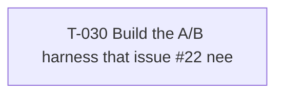

# Plan

_Generated 2026-09-20T14:27:20.232Z — 1 open, 30 done. Edit tasks in `tasks/` (or via task_update), not here._

## In progress
_none_

## Review
| id | title | status | owner | depends on | updated |
|---|---|---|---|---|---|
| [[tasks/T-030\|T-030]] | Build the A/B harness that issue #22 needs. The issue says criteria 2, 3, 8 and 11 are unmeasured be | review | deepseek/deepseek-flash |  | 2026-09-19 17:20 |

## Blocked
_none_

## Todo
_none_

## Done
| id | title | status | owner | depends on | updated |
|---|---|---|---|---|---|
| [[tasks/T-001\|T-001]] | In model-gateway/src/config.ts add named project modes that derive the GitHub policy. | done | deepseek/deepseek-v4-pro |  | 2026-09-18 16:00 |
| [[tasks/T-002\|T-002]] | Make harness sub-agent sessions visible, so a user can watch or type into one. | done | deepseek/deepseek-v4-pro | T-001 | 2026-09-18 16:00 |
| [[tasks/T-003\|T-003]] | Add a named read-only task shape, so the safest form of delegation has an obvious name. | done | deepseek/deepseek-v4-pro | T-002 | 2026-09-18 16:00 |
| [[tasks/T-004\|T-004]] | Add event-driven fleet supervision so the lead stops paying tokens to poll. | done | deepseek/deepseek-v4-pro | T-003 | 2026-09-18 16:00 |
| [[tasks/T-005\|T-005]] | Install a turn-end guard so the lead cannot silently end a turn while the fleet is still working. Th | done | deepseek/deepseek-v4-pro | T-004 | 2026-09-18 16:00 |
| [[tasks/T-006\|T-006]] | Make harness sub-agent sessions visible, so a user can watch or type into one. | done | deepseek/deepseek-v4-pro |  | 2026-09-18 16:00 |
| [[tasks/T-007\|T-007]] | Add a named read-only task shape, so the safest form of delegation has an obvious name. | done | deepseek/deepseek-v4-pro | T-006 | 2026-09-18 16:00 |
| [[tasks/T-008\|T-008]] | Add event-driven fleet supervision so the lead stops paying tokens to poll. | done | deepseek/deepseek-v4-pro | T-007 | 2026-09-18 16:00 |
| [[tasks/T-009\|T-009]] | Install a turn-end guard so the lead cannot silently end a turn while the fleet is still working. se | done | deepseek/deepseek-v4-pro | T-008 | 2026-09-18 16:00 |
| [[tasks/T-010\|T-010]] | Add a named read-only task shape, so the safest form of delegation has an obvious name. | done | deepseek/deepseek-v4-pro |  | 2026-09-18 16:00 |
| [[tasks/T-011\|T-011]] | Add event-driven fleet supervision so the lead stops paying tokens to poll. | done | deepseek/deepseek-v4-pro | T-010 | 2026-09-18 16:00 |
| [[tasks/T-012\|T-012]] | Install a turn-end guard so the lead cannot silently end a turn while the fleet is still working. se | done | deepseek/deepseek-v4-pro | T-011 | 2026-09-18 16:00 |
| [[tasks/T-013\|T-013]] | Finish the scout task shape. The engine is done; the MCP surface is not. | done | deepseek/deepseek-v4-pro |  | 2026-09-18 16:00 |
| [[tasks/T-014\|T-014]] | Add event-driven fleet supervision so the lead stops paying tokens to poll. | done | deepseek/deepseek-v4-pro | T-013 | 2026-09-18 16:00 |
| [[tasks/T-015\|T-015]] | Install a turn-end guard so the lead cannot silently end a turn while the fleet is still working. se | done | deepseek/deepseek-v4-pro | T-014 | 2026-09-18 16:00 |
| [[tasks/T-016\|T-016]] | Create ONE new file: model-gateway/src/fleet.ts. Do not modify any other file in this task. | done | deepseek/deepseek-v4-pro |  | 2026-09-18 06:14 |
| [[tasks/T-017\|T-017]] | Expose the fleet module through the gateway. Modify only model-gateway/src/index.ts. | done | deepseek/deepseek-v4-pro | T-016 | 2026-09-18 06:20 |
| [[tasks/T-018\|T-018]] | Install a turn-end guard, so the lead cannot silently end a turn while the fleet is still working. s | done | deepseek/deepseek-v4-pro | T-017 | 2026-09-18 06:26 |
| [[tasks/T-019\|T-019]] | Make the turn-end guard's output contract correct. Modify ONLY model-gateway/src/index.ts. | done | deepseek/deepseek-v4-pro |  | 2026-09-18 16:00 |
| [[tasks/T-020\|T-020]] | Register a Claude Code `Stop` hook so the lead cannot silently end a turn while the fleet is still w | done | deepseek/deepseek-v4-pro | T-019 | 2026-09-18 06:57 |
| [[tasks/T-021\|T-021]] | Add Star Trek model aliases alongside the existing ones. Modify ONLY model-gateway/src/config.ts. | done | deepseek/deepseek-v4-pro |  | 2026-09-18 16:00 |
| [[tasks/T-022\|T-022]] | Bring the Star Trek vocabulary into the documentation, without renaming anything. | done | deepseek/deepseek-v4-pro | T-021 | 2026-09-18 16:00 |
| [[tasks/T-023\|T-023]] | Teach the fleet queue about CI, so a push cannot be forgotten. Modify ONLY model-gateway/src/fleet.t | done | deepseek/deepseek-v4-pro |  | 2026-09-18 16:00 |
| [[tasks/T-024\|T-024]] | Make pushes enqueue CI work and make the watcher resolve it. | done | deepseek/deepseek-v4-pro | T-023 | 2026-09-18 16:00 |
| [[tasks/T-025\|T-025]] | Add model competence tiers and a fallback floor, so the router can never silently substitute a model | done | deepseek/deepseek-v4-pro |  | 2026-09-18 16:00 |
| [[tasks/T-026\|T-026]] | Make the tier floor actually apply to delegation. Until now tiers exist but nothing consults them. | done | deepseek/deepseek-v4-pro |  | 2026-09-18 16:00 |
| [[tasks/T-027\|T-027]] | Analyse the OWNERSHIP BOUNDARY and the COLLISIONS between firstmate (cloned at .firstmate/) and brea | done | deepseek/deepseek-flash |  | 2026-09-19 16:23 |
| [[tasks/T-028\|T-028]] | Design how break-free should VENDOR and UPDATE firstmate. Analysis only; change no files. | done | deepseek/deepseek-flash |  | 2026-09-19 16:24 |
| [[tasks/T-029\|T-029]] | Design the answer to the ACTUAL PAIN: five worktrees in flight, finishing at different times, and me | done | deepseek/deepseek-flash |  | 2026-09-19 16:24 |
| [[tasks/T-031\|T-031]] | Write the integration design for issue #31: break-free wrapping firstmate. Output ONE new file, docs | done | deepseek/deepseek-flash |  | 2026-09-19 17:16 |

