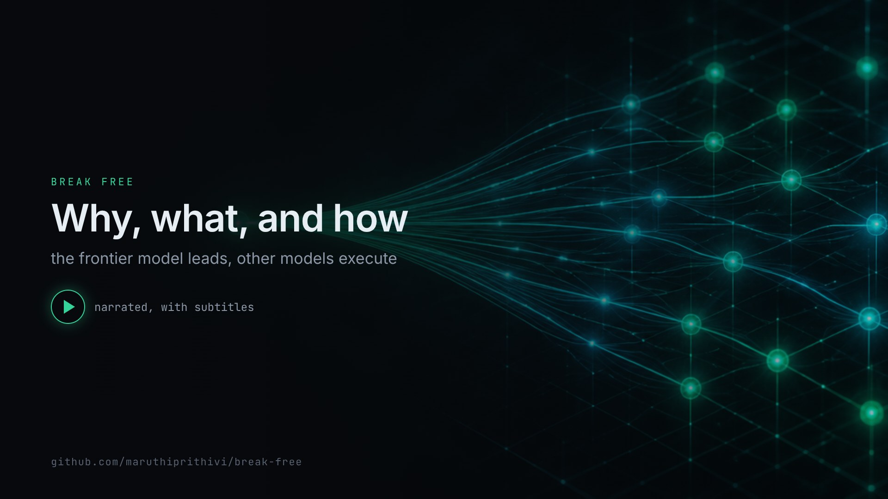
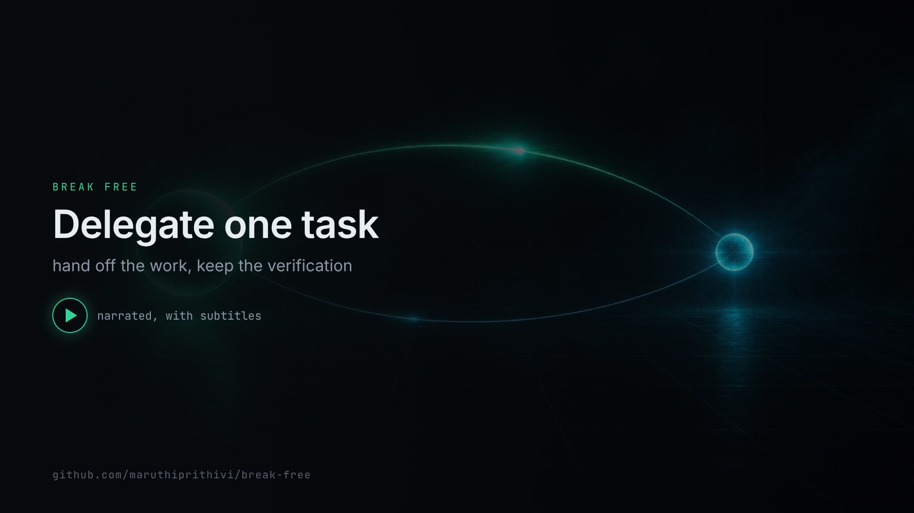
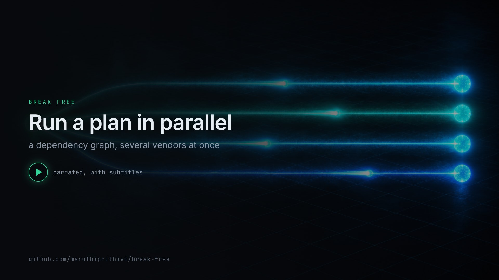
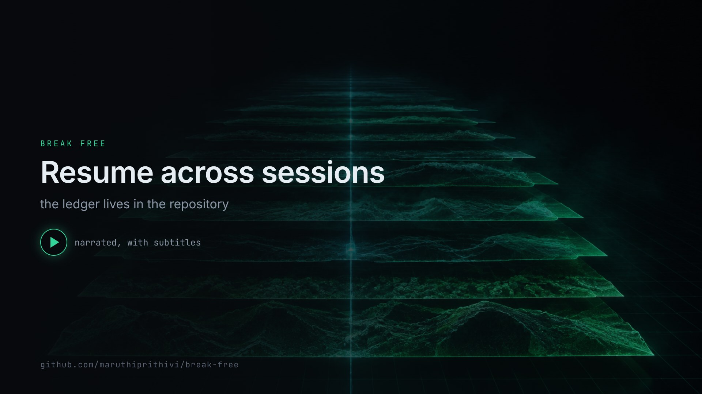

<p align="center">
  
</p>

<h1 align="center">Break Free</h1>
<p align="center"><b>The frontier model leads. Other models execute.</b></p>
<p align="center">
  <a href="#install">Install</a> ·
  <a href="#watch-it">Watch it</a> ·
  <a href="#using-it">Using it</a> ·
  <a href="#testing">Testing</a> ·
  <a href="CHANGELOG.md">Changelog</a>
</p>

Claude Code and Codex earn their price on one part of a task: understanding what you actually want, breaking it down, deciding how the result will be proven, and judging what comes back. They charge exactly the same for the rest of it — the boilerplate, the unit tests, the migration, the docs, the bulk edit.

Break Free is a single MCP server that splits those two jobs. Your agent stays the **lead** and keeps the judgement. The **crew** — DeepSeek, Kimi/Moonshot, MiniMax, Z.AI/GLM, Ollama local and cloud, OpenRouter, OpenCode Zen, any vLLM or LM Studio endpoint — does the execution: in parallel, verified by a command **the gateway runs itself**, reviewed by a different vendor, and recorded in a Markdown ledger that outlives the session.

```bash
curl -fsSL https://raw.githubusercontent.com/maruthiprithivi/break-free/main/install.sh | bash
```

## Watch it

<a href="docs/assets/intro.mp4"></a>

**[Break Free in two minutes](docs/assets/intro.mp4)** — why it exists, what it is, and how the verification actually works. Narrated, with burned-in subtitles and a [WebVTT track](docs/assets/intro.vtt).

Four walkthroughs, about half a minute each:

<table>
<tr>
<td width="50%"><a href="docs/assets/delegate.mp4"></a><b><a href="docs/assets/delegate.mp4">Delegate one task</a></b><br>Hand off the work, keep the verification.</td>
<td width="50%"><a href="docs/assets/parallel.mp4"></a><b><a href="docs/assets/parallel.mp4">Run a plan in parallel</a></b><br>A dependency graph, several vendors at once.</td>
</tr>
<tr>
<td width="50%"><a href="docs/assets/review.mp4"></a><b><a href="docs/assets/review.mp4">Get an independent verdict</a></b><br>A different vendor reviews; a panel decides.</td>
<td width="50%"><a href="docs/assets/ledger.mp4"></a><b><a href="docs/assets/ledger.mp4">Resume across sessions</a></b><br>The ledger lives in the repository.</td>
</tr>
</table>

Subtitle tracks: [delegate](docs/assets/delegate.vtt) · [parallel](docs/assets/parallel.vtt) · [review](docs/assets/review.vtt) · [ledger](docs/assets/ledger.vtt). Source and render pipeline: [`videos/`](videos/).

## Install

### One command

```bash
curl -fsSL https://raw.githubusercontent.com/maruthiprithivi/break-free/main/install.sh | bash
```

That script clones into `~/.break-free`, checks that your Node is new enough, and hands over to the real installer. Re-run it any time — it fast-forwards the checkout and re-installs over the top. Flags pass straight through:

```bash
curl -fsSL https://raw.githubusercontent.com/maruthiprithivi/break-free/main/install.sh | bash -s -- --yes
```

`BREAK_FREE_HOME=/somewhere/else` moves the checkout; `BREAK_FREE_BRANCH` picks a branch.

Piping a script into a shell is a reasonable thing to be wary of. Read it first if you prefer:

```bash
curl -fsSL https://raw.githubusercontent.com/maruthiprithivi/break-free/main/install.sh -o install.sh
less install.sh && bash install.sh
```

### Or from a clone

```bash
git clone https://github.com/maruthiprithivi/break-free.git && cd break-free
./install.sh                    # identical to `node setup.mjs`
```

### What you need

| | |
|---|---|
| **Node** | 20 or newer (`node -v`) |
| **git** | any recent version |
| **An agent** | Claude Code and/or Codex — [other harnesses](#other-coding-agents-gemini-cli-copilot-cli-cursor-goose-amp-hermes-aider-cline-adal-openclaw-droid-kilo-code-roo-code-qoder-zed-opencode-kiro-cli-kimi-code-cli-antigravity-agy-pi-oh-my-pi-omp) are supported too |
| **One model, minimum** | any provider key, or a local Ollama / vLLM endpoint — no key needed |
| **`gh`** | optional; only for the `github` worker capability |

### What the installer asks

It runs **preflight → scope → build → providers and keys → install → postflight**, printing one line per check:

```
== Preflight
  PASS  Node 22.22.2
  PASS  Claude Code CLI — 2.1.x
  WARN  gh CLI not found — github capability will be unavailable
        fix: brew install gh
== Providers & API keys
  DeepSeek API key  [Enter = use DEEPSEEK_API_KEY from your shell; or type skip / env / keep]:
  PASS  deepseek: key accepted — 12 models available
  PASS  deepseek: deepseek-v4-flash works — 812 ms
== Postflight (real MCP handshake + live provider calls)
  PASS  MCP handshake ok in 210 ms — 13 tools
  ●  GREEN — everything checks out. Good to go.
```

The questions, in order:

1. **Scope, per agent** — user level, project level, both, or skip (and which project directory).
2. **Which providers to walk through** — a checklist showing each one's current state (saved key, env var, base URL, chosen model), so you can switch off the ones you no longer use.
3. **Where keys live** — a config file at mode `600`, or `${ENV_VAR}` references that resolve at runtime.
4. **Each key** — pasted hidden, or `env` / `keep` / `skip`. Every key is verified against the live API, the provider's real model list is fetched and shown as a numbered menu (type part of a name to filter a big catalog), and you pick the default from it. A failed verification offers: another model, another key, save anyway, or skip.
5. **Local endpoints** — your Ollama or vLLM URL is probed; models are listed with size and loaded state, and the default comes from what you have actually pulled.
6. **Policy** — protected branches, and whether workers may push or merge at all.
7. **Model chains** — a numbered catalog of every model your providers serve *right now*, with a suggested sequence for each alias (`fast`, `strong`, `reviewer`, `local`) and for the global fallback chain. Enter accepts the suggestion, or type the order you want (`3,1,7`).
8. **GitHub work tracking** — whether to also install [`break-free-github-flow`](#break-free-github-flow-work-tracking-ci-and-deployment-discipline-optional).

Suggestions are built from live model lists only, so a retired model name can never end up in your config, and an alias still pointing at a vanished model is flagged and replaced. Before the policy and chain steps a **review table** lists every provider (verified / unverified / off, default model) and lets you redo any row.

Every `FAIL` and `WARN` carries a fix. The verdict is **GREEN**, **GREEN with warnings**, or **RED** — and `RED` exits `1`. Full log: `~/.config/model-gateway/setup.log`; machine-readable result: `setup-report.json`.

Everything lands under the `break-free-*` prefix, and re-running the installer removes any earlier unprefixed install automatically:

| | |
|---|---|
| Skills | `break-free-model-gateway`, `break-free-github-flow` |
| Commands | `/break-free-plan` `/break-free-resume` `/break-free-delegate` `/break-free-review` `/break-free-panel` `/break-free-supervise` `/break-free-issue` `/break-free-ci` `/break-free-wrap-up` |
| MCP server | `break-free-gateway` (Claude Code) · `break_free_gateway` (Codex) |

**Scopes.** User level writes `~/.claude/skills/`, `~/.claude/commands/*.md`, the MCP server via `claude mcp add --scope user`, `~/.agents/skills/`, an `[mcp_servers.break_free_gateway]` table in `~/.codex/config.toml`, and a note in `~/.codex/AGENTS.md`. Project level writes `<repo>/.mcp.json`, `<repo>/.claude/{skills,commands}`, `<repo>/.agents/skills`, `<repo>/.codex/config.toml`, appends to `AGENTS.md`, and adds `.model-gateway.json` to `.gitignore`. Claude Code asks once to approve a project `.mcp.json`; Codex reads a project `.codex/config.toml` only for trusted projects.

### Check that it worked

```bash
node ~/.break-free/setup.mjs --doctor     # or ./setup.mjs --doctor from a clone
claude mcp list                           # break-free-gateway ... ✓ Connected
```

Then, inside Claude Code, either of these should answer:

```
/break-free-resume
list providers
```

### When it does not work

| Symptom | Cause | Fix |
|---|---|---|
| `node not found`, or "Node … is too old" | Node below 20 | `nvm install 20 && nvm use 20`, or `brew upgrade node` |
| The installer ends **RED** | a preflight or postflight check failed | read the `FAIL` line — it carries its own fix — then `node setup.mjs --doctor` |
| `claude mcp list` shows the server but not connected | the build did not run, or the path moved | `node setup.mjs --yes` re-builds and re-registers |
| Codex refuses to start, complaining about `wire_api` | a leftover `wire_api = "chat"` provider ([codex#7782](https://github.com/openai/codex/discussions/7782)) | `node setup.mjs --doctor` finds it and offers to rewrite it |
| One provider fails every call | wrong key, or a model that no longer exists | `node setup.mjs --doctor` reads the [runtime log](#runtime-log--diagnosing-problems) and names it; or ask the agent to "run gateway_logs" |
| The piped install cannot prompt | no terminal (CI, a container) | `curl … \| bash -s -- --yes --answers answers.json` |
| The installer itself misbehaves | — | `bash setup/selftest.sh` — it tests the installer against fake `claude`/`codex` CLIs, a throwaway `HOME` and a mock provider |

### Every installer command

| Command | What it does |
|---|---|
| `node setup.mjs` | interactive install / re-install (safe to re-run; merges into existing config, rolling `.bak` of every file it rewrites) |
| `node setup.mjs --doctor [--project DIR] [--last N]` | diagnose only, change nothing: prerequisites, config validity and permissions, skill freshness, MCP registrations, **model catalog drift** (every alias/default checked against each provider's live list, with closest replacements), **runtime-log analysis** (per-provider failure rates and fixes), real handshake + provider calls |
| `node setup.mjs --uninstall [--project DIR] [--purge]` | remove registrations, skills and commands; `--purge` also deletes config, keys and sessions |
| `node setup.mjs --yes` | **hands-free re-install / upgrade**: no prompts; keeps and re-verifies everything already in `~/.config/model-gateway/config.json` (keys, default models, aliases, chains, disabled providers), refreshes skills/commands/registrations, cleans up old names |
| `node setup.mjs --update` | **self-update**: `git pull --ff-only` the source, then re-run hands-free reusing the scope/agents saved in `last-install.json` (also `/break-free-update` inside Claude Code) |
| `node setup.mjs --stats [--project DIR]` | read-only storage footprint (sessions, jobs, logs, harness) + project ledger/worktree stats |
| `node setup.mjs --clean [--days N]` | reclaim disk: delete sessions/jobs older than N days (default 30) and old log generations |
| `node setup.mjs --answers my.json` | non-interactive with explicit answers (CI, dotfiles); template in `setup/answers.example.json` |
| `node setup.mjs --project DIR` | pre-select the project directory for project-level scope |
| `node setup.mjs --skip-tests` | skip the test suite that runs after building |
| `bash setup/selftest.sh` | tests the installer itself against fake `claude`/`codex` CLIs, a throwaway HOME and a mock provider — run this first if the installer misbehaves |

### Install it by hand

<details><summary>Manual steps</summary>

```bash
cd model-gateway && npm install && npm run build
cp config.example.json ~/.config/model-gateway/config.json && chmod 600 ~/.config/model-gateway/config.json   # edit keys
# Claude Code
claude mcp add --scope user --transport stdio break-free-gateway -- node /ABS/PATH/model-gateway/dist/index.js
cp -R ../agent-config/claude/skills/break-free-model-gateway ~/.claude/skills/ && cp ../agent-config/claude/commands/*.md ~/.claude/commands/
# Codex
codex mcp add break_free_gateway -- node /ABS/PATH/model-gateway/dist/index.js      # then apply agent-config/codex/config.toml.snippet (tool_timeout_sec, env_vars)
mkdir -p ~/.agents/skills && cp -R ../agent-config/codex/skills/break-free-model-gateway ~/.agents/skills/
```
Keys: env vars (`DEEPSEEK_API_KEY`, `MOONSHOT_API_KEY`, `MINIMAX_API_KEY`, `ZAI_API_KEY`, `OPENROUTER_API_KEY`, `OPENCODE_API_KEY`, `OLLAMA_API_KEY`, `GH_TOKEN`), the config file (literal or `"${VAR}"`), or the `configure_provider` tool from inside the agent. Server flags: `--workspace DIR` · `--config FILE` · `--stateless` · `--selftest` · `--print-config`.
</details>

## The operating model

| Lead (Claude Code / Codex, frontier model) | Crew (DeepSeek, Kimi, GLM, MiniMax, Ollama, …) | Gateway (this server) |
|---|---|---|
| Talks to the user; decomposes the goal into self-contained tasks with dependencies | Executes one task each, in parallel, with jailed tools | Schedules the graph with bounded concurrency; hands prerequisite reports to dependants |
| Writes acceptance criteria and **the `verify` command** for each task | Runs tests itself (`run` capability) before reporting | **Runs `verify` after the worker** — real exit code, cannot be faked; failure blocks dependants |
| Decides which vendor does what (`fast`/`strong`/`local`, different vendor for review) | Records decisions/gotchas it hits (`ledger_note`) | Routes with fallback; injects CLAUDE.md/AGENTS.md, skills and ledger knowledge into every worker |
| Reads the consolidated report, diffs, review verdicts; pushes back; commits; owns the result | | Tracks every task, outcome and verification in `.break-free/` so any later session resumes |

The `break-free-model-gateway` skill (auto-invoked via a CLAUDE.md / AGENTS.md rule) carries this doctrine: *delegate execution by default, keep judgement, specify verification instead of narrating it, keep the ledger true.*

## Architecture

```
Claude Code / Codex  ──MCP(stdio)──▶  break-free-gateway
   (lead)                              ├─ run_plan    N tasks as a dependency graph, parallel, per-task model/caps/verify/review
                                       ├─ delegate    one worker (+ verify command, session, lent MCP servers, async)
                                       ├─ supervise   worker ⇄ supervisor loop; failing verification can't be accepted
                                       ├─ review      independent scrutiny (different vendor) → JSON verdict
                                       ├─ panel       N models in parallel + judge
                                       ├─ jobs        async delegations/plans: status, result, cancel; persisted
                                       ├─ ledger      .break-free/ tasks · notes · journal · HANDOFF.md · CODE-MAP.md (Obsidian-ready)
                                       ├─ mcp bridge  lends the lead's other MCP servers to workers (destructive tools filtered)
                                       ├─ router      alias → [candidates…] + global chain, retry/fallback
                                       └─ worker tools read_file/search/git_diff · write_file/edit_file · run_command (allow-list) ·
                                                      git_commit/push (no force, no main) · gh issues/PRs/Actions · mcp__<server>__<tool>
```

Two things in that picture do the real work. `verify` is a shell command **the gateway runs after the worker finishes**, so a pass is an exit code rather than a claim. The ledger is plain Markdown inside your repository, so the next session — or the next person — starts from what already happened.

## Using it

From Claude Code:
```
/break-free-resume                                   where were we? (reads .break-free/HANDOFF.md, collects finished jobs)
/break-free-plan add rate limiting to the API with tests, docs and a migration
/break-free-delegate fast write unit tests for src/router.ts covering alias expansion and fallback ordering
/break-free-review staged security
/break-free-panel should we move the session store to SQLite or keep JSON files?
/break-free-supervise implement rate limiting in src/server.ts --caps read,write,run --rounds 3
```
or just in prose: *"split this into parallel chunks and run them on deepseek, then have kimi review"*, *"hand the boilerplate to a cheap model"*, *"get a second opinion from three different vendors"*, *"have a local model do this, don't send the code anywhere"*, *"pick up where we left off"*. The skill tells the lead when to reach for the gateway, how to write instructions and verification, and how to judge what comes back.

From Codex: `$break-free-model-gateway plan …` or the same natural-language requests.

### run_plan: parallel crews with gates
```jsonc
run_plan({
  goal: "rate limiting",
  review: true,                                   // every task independently reviewed (different vendor)
  tasks: [
    { id: "core",  task: "implement TokenBucket in src/ratelimit.ts …", model: "strong", capabilities: ["read","write","run"], verify: "npm test -- ratelimit", acceptance: "…" },
    { id: "tests", task: "write tests for src/ratelimit.ts …",           model: "fast",   capabilities: ["read","write","run"], depends_on: ["core"], verify: "npm test -- ratelimit" },
    { id: "docs",  task: "document the limiter in docs/api.md …",        model: "local",  capabilities: ["read","write"],       depends_on: ["core"] },
    { id: "wire",  task: "wire the limiter into src/server.ts …",        model: "deepseek/deepseek-v4-pro", capabilities: ["read","write","run"], depends_on: ["core"], supervise: true, verify: "npm test" }
  ],
  async: true                                    // returns a job id; job_status {wait_ms} / job_result
})
```
`tests`, `docs` and `wire` run in parallel once `core` is done and receive its report as context; a failing `verify` fails the task and skips its dependants; a reviewer `reject` fails it, `revise` marks it for your attention; every task lands in the ledger with outcome and verification. `workers.maxConcurrency` (default 4) caps parallelism.

### The ledger: long-horizon memory in the repo
`.break-free/` is created on first use (`ledger_resume {init:true}`, `task_create`, `note_write` or a tracked `run_plan`) and is plain Markdown — commit it, diff it, or open the folder as an **Obsidian vault**:

| file | what | who writes |
|---|---|---|
| `HANDOFF.md` | resume brief: in progress / blocked / ready, decisions, gotchas, recent activity | generated |
| `PLAN.md` | board by status + Mermaid dependency graph | generated |
| `tasks/T-001.md` | frontmatter (status, owner, depends_on, verify, tags) + Problem / Acceptance criteria / Outcome / Log | lead (`task_*`), `run_plan`, workers (`ledger_task_log`) |
| `notes/<slug>.md` | decisions, gotchas, conventions, how-tos with `[[wikilinks]]` — those tagged `decision/gotcha/convention/howto` are injected into every worker | lead (`note_write`), workers (`ledger_note`) |
| `journal/<date>.md` | append-only: what was delegated to which model, verified how, outcome | gateway |
| `CODE-MAP.md` | directories, most-depended-on modules, Mermaid import graph, exported symbols (TS/JS, Python, Go, Rust) | `code_map` |

Both Claude Code and Codex read the same ledger, so you can start in one and continue in the other. Background jobs are persisted under `~/.config/model-gateway/sessions/jobs/`, so a new session can `job_list` → `job_result` what an earlier one started.

### Multi-agent work across worktrees
Run several agents on one repo — Claude Code on `main`, Codex in one worktree, opencode / kiro / kimi / pi / omp / agy in others — and let them share one map. The registry lives in the git **common dir** (`.git/break-free/worktrees.json`), so every checkout of the repository sees the same data instantly and it never diverges across branches; `worktree_sync` renders it to `.break-free/WORKTREES.md` (commit that from main for history).

| tool | does |
|---|---|
| `worktree_list` | every worktree with status + reason, agent, purpose, ledger tasks, issues, PRs, tools, models, last hand-off — reconciled with `git worktree list` on each call |
| `worktree_register` | claim the current checkout (purpose, agent, tasks, issues, PRs, tools, models); idempotent, acts as heartbeat |
| `worktree_create` | `git worktree add` under `<repo>.worktrees/<branch>` + register — hand the path to another agent or a second gateway (`--workspace`) |
| `worktree_update` / `worktree_handoff` | status changes with mandatory reasons (`inactive`, `blocked`, `abandoned`, `deleted`), new PRs/issues/tools, hand-off notes (done / next / verify / gotchas) |
| `worktree_remove` | remove a checkout (branch kept) with a reason; refuses main, the current tree, dirty trees and unmerged branches unless `force` |

Automatic states: a branch whose commits are all in its base → `merged`; a checkout that vanished → `deleted` ("removed outside the gateway" unless a reason was recorded); no commit/heartbeat for `worktrees.inactiveAfterHours` (48h) → `inactive`. The map is injected into every delegated worker's prompt and into `ledger_resume`, so a worker in one tree knows not to touch another tree's branch.

### How the ledger survives merges — main is the single source of truth
The obvious failure: every worktree commits its own `.break-free/` on its branch, and the PR that merges the code also merges (or conflicts on, or overwrites) main's tasks, notes and journal. Break Free avoids it structurally:

| where | what the gateway does |
|---|---|
| main checkout | reads and writes the committed `.break-free/` — the only copy git ever sees change |
| linked worktree | reads main's **live** `.break-free/` underneath a local overlay in `.git/break-free/shadow/<branch>/`; all writes (tasks with ids `T-<branch>-001`, notes, journal, task updates as copy-on-write) go to the overlay, so `git status` on the branch never shows ledger changes |
| `worktree_create` / installer (project scope) | install a pre-commit hook in the repo's **common** hooks dir (applies to every worktree; an existing hook is chained) that refuses to commit `.break-free/` from a linked worktree; `git_commit` from the gateway drops it from the index too |
| `ledger_guard {action:"install"}` | also writes `.github/workflows/break-free-ledger-guard.yml`, which fails any PR whose diff against the base touches `.break-free/` — the belt to the hook's braces, for branches pushed from elsewhere |
| `ledger_merge_from` (and `ledger_resume` on main, and `worktree_remove`) | absorbs each overlay into main: tasks by id (newer record wins field by field, logs unioned), notes by slug (identical/contained → fuller one; divergent → main's text kept, worktree's appended under `## From <worktree>`), journal lines unioned with `[worktree]` prefix; idempotent; `commit:true` commits on main, never pushes; the registry records `ledgerMergedAt` per worktree |

So a PR from a worktree branch carries code only; main's knowledge is never overwritten by a merge, and main is always the freshest view because it absorbs on every `ledger_resume`. Verified end to end in the test-suite: overlay isolation, hook refusal, `git_commit` stripping, absorb + idempotency, divergent-note merge, a real `git merge` of the branch leaving `.break-free/` untouched, workflow install.

### Other coding agents: Gemini CLI, Copilot CLI, Cursor, Goose, Amp, Hermes, Aider, Cline, AdaL, OpenClaw, Droid, Kilo Code, Roo Code, Qoder, Zed, opencode, Kiro CLI, Kimi Code CLI, Antigravity (agy), pi, oh-my-pi (omp)
The installer detects these (binary on PATH or config dir present), lets you pick which to wire (`extra_agents` in the answers file: list, `"detected"` or `"all"`; `extra_scope`: user / project / both), and installs the MCP server, both `break-free-*` skills, and the standing rules — in each tool's own conventions. Where a tool's MCP servers can't be edited by file (or its MCP support is experimental), the installer prints the exact one-line registration command instead:

| agent | MCP server | skills | standing rules |
|---|---|---|---|
| opencode | `~/.config/opencode/opencode.json` `mcp.break-free-gateway` (`type:"local"`); project `opencode.json` | `~/.config/opencode/skills/` (also reads `.agents/skills`) | `~/.config/opencode/AGENTS.md`; project `AGENTS.md` |
| Kiro CLI | `~/.kiro/settings/mcp.json`; project `.kiro/settings/mcp.json` | `~/.kiro/skills/`; `.kiro/skills/` | `~/.kiro/steering/break-free.md`; `.kiro/steering/break-free.md` |
| Kimi Code CLI | `~/.kimi/mcp.json` | `~/.kimi/skills/` (also `.agents/skills`) | project `AGENTS.md` |
| Antigravity (agy) | `~/.gemini/config/mcp_config.json`; project `.agents/mcp_config.json` | `~/.gemini/config/skills/` (also `.agents/skills`) | `~/.gemini/GEMINI.md`; `.agents/rules/break-free.md` |
| pi | `~/.pi/agent/mcp.json` (needs `pi install npm:pi-mcp-adapter` once); project `.mcp.json` | `~/.pi/agent/skills/`; `.pi/skills/` | `~/.pi/agent/AGENTS.md`; project `AGENTS.md` |
| oh-my-pi | `~/.omp/agent/mcp.json`; `.omp/mcp.json` | `~/.omp/agent/skills/`; `.omp/skills/` | `~/.omp/agent/AGENTS.md`; `.omp/AGENTS.md` |
| Gemini CLI | `~/.gemini/settings.json` `mcpServers`; project `.gemini/settings.json` | `~/.gemini/skills/`; `.gemini/skills/` (also `.agents/skills`) | `~/.gemini/GEMINI.md`; project `GEMINI.md` |
| GitHub Copilot CLI | manual: `copilot mcp add break-free-gateway -- node <dist/index.js>` | `~/.copilot/skills/` | `~/.copilot/AGENTS.md`; project `AGENTS.md` |
| Hermes Agent | manual: `mcp_servers:` block in `~/.hermes/config.yaml` (or `hermes import-agent claude-code`) | `~/.hermes/skills/` | `~/.hermes/AGENTS.md`; project `AGENTS.md` |
| Aider | manual (experimental MCP) | — | `~/.aider.conf.yml` / `.aider.conf.yml` `read: AGENTS.md` |
| Cline | manual (editor settings `cline_mcp_settings.json`) | — | `~/.clinerules`; project `.clinerules` |
| AdaL CLI | manual (AdaL UI) | — | `~/.adal/AGENTS.md`; project `AGENTS.md` |
| OpenClaw | manual: `openclaw mcp add break-free-gateway` | — | `~/.openclaw/AGENTS.md`; project `AGENTS.md` |
| Cursor | `~/.cursor/mcp.json`; project `.cursor/mcp.json` | (reads `.agents/skills`) | reads `AGENTS.md` + `.cursor/rules` |
| Goose (Block) | manual: `extensions` in `~/.config/goose/config.yaml` (or `goose configure`) | `~/.config/goose/skills/` | project `AGENTS.md` |
| Amp (Sourcegraph) | manual: skill `mcpServers` / Amp MCP config | `~/.config/agents/skills/` | project `AGENTS.md` |
| Droid (Factory) | reads project `.mcp.json` | `~/.agents/skills/`; `.agents/skills/` | project `AGENTS.md` |
| Kilo Code | manual | `~/.agents/skills/`; `.agents/skills/` | project `AGENTS.md` |
| Roo Code | manual | `~/.agents/skills/`; `.agents/skills/` | project `AGENTS.md` |
| Qoder | manual | `~/.agents/skills/`; `.agents/skills/` | project `AGENTS.md` |
| Zed | reads project `.mcp.json` | `~/.agents/skills/`; `.agents/skills/` | project `AGENTS.md` |

Existing entries in those files are preserved (JSON is merged, rules are marker-based and self-updating), `--doctor` reports each agent, `--uninstall` removes only what was added. All of them then share the same ledger and worktree registry, so a hand-off written by kiro in one worktree is what Claude Code reads on main.

Everything else that reads `AGENTS.md` + `.mcp.json` + `.agents/skills` — Crush, Windsurf, Trae, JetBrains Junie, Warp, Continue.dev, Augment, Freebuff, Devin — is covered automatically at project scope by the files `installProject` writes, with no per-tool config needed.

### Guardrails the gateway enforces
| what | how |
|---|---|
| **Policy rules** (`configure_policy`, or `policy.rules` in `.model-gateway.json` — allowed at project scope because rules only add restrictions) | `deny` globs are unreadable/unwritable/unsearchable for workers on that call; `review` globs trigger an automatic independent review by a different vendor when a worker changed a matching path (detected by snapshotting the tree before/after, including commits); a `reject` fails the task in `run_plan`, `supervise` un-accepts. Reported in `meta.policy`. |
| **Budgets** (`configure_budget`, `cost_report`) | every call is priced (list prices in `DEFAULT_PRICING`, override with `pricing`); `meta.cost_usd` everywhere; `perTaskUsd` stops a worker, `perPlanUsd` cancels the plan's remaining tasks, `perDayUsd` refuses new delegations; `cost_report` gives spend per day/provider/model and today vs cap. |
| **Worker-note quarantine** (`note_review`) | notes from `ledger_note` carry `trust: worker, pending: true` and are never injected into other workers until promoted; a worker cannot overwrite a lead note (its text becomes a pending proposal section); rejected notes go to `notes/rejected/`; absorption from worktrees preserves the pending flag. This closes the model-to-model prompt-injection path through the ledger. |
| **Overlap detection** (`worktree_list.overlaps`) | files changed by two live worktrees relative to their base, plus declared `paths` claims that cover another worktree's changes; surfaced in the worker prompt as `OVERLAP`. |
| **Steward** (`steward`, `--steward`, `break-free-steward`) | absorb overlays → reconcile worktrees (overlaps, removable merged checkouts) → hygiene (`ledger_doctor`: stale note paths, old done tasks, old journal; `archive:true` moves to `archive/`) → refresh `CODE-MAP.md` → run `steward.verify` on main → regenerate HANDOFF/WORKTREES → journal. Cron-friendly, exit 1 if verify fails. |

### Lending your MCP servers to workers
`list_mcp_servers` shows servers from `config.workers.mcp.servers`, `~/.claude.json` (user + project scope), `<workspace>/.mcp.json` and `~/.codex/config.toml`. Nothing is exposed unless a call names it: `delegate({ …, mcp_servers: ["postgres", "playwright"] })`. Tools appear to the worker as `mcp__postgres__query`; anything matching `workers.mcp.denyTools` (`*delete*`, `*remove*`, `*drop*`, `*destroy*`, `*purge*`, `*wipe*`, `*truncate*` by default) is never exposed, and a server entry may add `allowTools`. Stdio, streamable-HTTP and SSE transports; `${ENV}` expansion in env/args/url/headers.

### Model specs
`fast` `strong` `reviewer` `local` `cloud` (aliases, each an ordered fallback chain) · `deepseek/deepseek-v4-pro` · `kimi/kimi-k3` · `zai/glm-5.3` · `minimax/MiniMax-M3` · `ollama/qwen3-coder:30b` · `ollama-cloud/gpt-oss:120b` · `openrouter/moonshotai/kimi-k3` · `opencode/deepseek-v4-flash` · bare `kimi` (provider default) · `a,b,c` (ad-hoc chain).

### Switching models from chat
Say it to the agent — "use kimi-k3 for `fast` from now on", "switch deepseek to deepseek-v4-pro for this repo", "reviews should go to glm-5.3 globally" — or `/break-free-model <change>`. The skill maps it to `configure_provider {default_model}`, `configure_alias {candidates}` or `configure_fallback {default_model|default_reviewer|default_supervisor}`, checks the live model list, and writes to `scope:"user"` (`~/.config/model-gateway/config.json`) or `scope:"project"` (`<repo>/.model-gateway.json`, committed, wins over user config in that repo; may only hold model choices, aliases, defaults and fallback order — never keys, base URLs or git policy). It then runs `test_provider` and reports which model actually answered. `list_models` shows the effective `provider_defaults` and which config files are in play.

### Fallback semantics
For each candidate in order: transient failures (429, 5xx, timeout, network) are retried `retriesPerCandidate` times with backoff, then the next candidate is tried; missing key / disabled / 401 / unknown model skip immediately to the next; `bad_request` (400) stops, because the request itself is wrong. After the alias/explicit list, `fallback.chain` is appended. `retryOn` controls which reasons are allowed to fall through. Every tool result ends with `meta: {"model": "…", "fallback_attempts": […]}`.

### Capabilities and guardrails
| capability | tools | can't |
|---|---|---|
| `read` | `read_file` `list_files` `search` `git_status` `git_diff` `git_log` | leave the workspace (symlinks resolved), read `.env*`, keys, `.git/`, `.model-gateway.json`, `workspace.denyPatterns` |
| `write` | `write_file` `edit_file` (+ `ledger_note` `ledger_task_log` when a ledger exists) | delete files |
| `run` | `run_command` | anything outside `workers.allowedCommands` prefixes (`npm test`, `pytest`, `go test`, `cargo test`, `make test`, … — edit the list in config); no shell, so `;` `&&` `|` `$()` are rejected; timeout `workers.commandTimeoutMs` |
| `mcp` | `mcp__<server>__<tool>` for servers named in `mcp_servers` | servers not lent for this call; tools matching `workers.mcp.denyTools` |
| `git` | `git_create_branch` `git_commit` `git_push` | force-push, amend, reset, rebase, delete branches, push `github.protectedBranches` |
| `github` | `gh_repo_view` · issues: create/list/view/comment/close · PRs: create/list/view(+diff)/comment/review/merge · Actions: list workflows/runs, view run, logs, watch, rerun, dispatch | delete/transfer/archive repos, delete branches, secrets, collaborators, `gh api` — none are exposed. Merge can be disabled (`github.allowMerge=false`), push too |

Hardening (each covered by a test): every model-supplied string that reaches `git`/`gh` is validated (refs, branch names, enums, arrays — nothing may start with `-`, so `--output=`, `--force`, `--admin`, `--delete-branch` are unreachable); denied files are stripped from diffs and never staged by `git_commit`; symlinks are skipped by `search`/`list_files` and resolved by the jail; a project `.model-gateway.json` (untrusted — it comes with the repo) may only set `defaults`, `aliases`, `fallback` and per-provider `defaultModel`/`enabled`/`extraBody` — it can never change base URLs, keys, protected branches or the workspace root.

GitHub auth is whatever `gh` uses (`gh auth login` or `GH_TOKEN`). Recommended: a fine-grained PAT with Contents RW, Issues RW, Pull requests RW, Actions RW, Workflows RW, Metadata R — nothing else, so even a jailbroken worker cannot exceed that.

## Testing

**Unit/e2e without any API key** (mock provider, ~2 s):
```bash
cd model-gateway && npm test
```
covers (46 tests): tool listing, provider usability + `${ENV}` keys, alias chains, live `/models`, fallback on 429/401/500/404/timeout and the global chain, `retryOn` enforcement, jailed reads (denied `.env`, blocked `../`), write gating, protected-branch push refusal, gh tool exposure, session persistence, review JSON with real diff, parallel panel + judge, supervise revise→accept, config persistence with 0600, git/gh option-injection refusal, secret-staging prevention, project-config sanitising, runtime log + redaction, harness context injection — and v3: MCP bridge discovery (config + `.mcp.json`, self excluded) with destructive-tool filtering and per-call lending, `run` capability allow-list without a shell, gateway-side `verify` (honest pass/fail/refused), supervise unable to accept a failing verification, `run_plan` parallelism/dependencies/context hand-down/skip-on-failure/cycle detection, review gate, async jobs (status/result/cancel/persistence), the ledger end to end (tasks, notes, resume brief, worker injection, worker notes, run_plan tracking, journal), `code_map`, token/job/MCP stats in `gateway_logs`, the Codex Responses-API shim (request translation, streaming events, tool-call reassembly, reasoning, error mapping), project-scope model switching, the worktree registry (two gateway instances in two checkouts sharing one registry, merged/deleted detection, reasons, hand-offs, guarded removal), ledger safety across worktrees (overlay, guard hook, absorb/merge semantics, merge leaves main's ledger untouched), cost accounting with task/plan/day caps, policy deny/review enforcement, worker-note quarantine and review, worktree overlap detection, and the steward routine.

**Provider status** (no calls made):
```bash
node dist/index.js --selftest          # exit 0 if ≥1 provider usable
```

**Real round-trip per provider** — inside Claude Code / Codex:
> "run test_provider for deepseek, kimi, zai, minimax, openrouter, opencode, ollama and ollama-cloud and show me a table"

or, without an agent, with the MCP inspector:
```bash
npx @modelcontextprotocol/inspector node dist/index.js
```
then call `list_providers` (`probe:true`) and `test_provider` (`spec:"deepseek"`). `test_provider` reports latency, the reply, and whether tool-calling works for that model.

**Exercise the mock provider interactively** (no keys):
```bash
node test/mock-provider.mjs &                  # http://127.0.0.1:8787/v1, key test-key
export MODEL_GATEWAY_CONFIG=/tmp/mg.json
cat > /tmp/mg.json <<'EOF'
{"providers":{"mock":{"baseUrl":"http://127.0.0.1:8787/v1","apiKey":"test-key"}},
 "aliases":{"fast":["mock/flaky429","mock/good"]},"fallback":{"chain":["mock/good"]}}
EOF
npx @modelcontextprotocol/inspector node dist/index.js
```
`delegate` with `model:"fast"` shows the 429 fallback in `meta`.

**Installer self-check**: `node setup.mjs --doctor` any time; `bash setup/selftest.sh` to test the installer itself in isolation.

**End-to-end in Claude Code**:
1. `claude mcp list` → `break-free-gateway … ✓ Connected`.
2. `/break-free-model-gateway` (or "list providers") → table of usable providers.
3. `/delegate local summarise what src/index.ts does` (Ollama running) — check the `meta.model` line.
4. Make an uncommitted change → `/review HEAD` → JSON verdict with file:line issues.
5. `/panel …` with three vendors → three seats + judge synthesis; a seat whose key is missing is reported as failed/fell back, not silently dropped.
6. In a throwaway repo with `gh` authenticated: `delegate` with `capabilities:["github"]`, task "create branch test/gateway, add hello.txt, commit, push, open a draft PR; do not merge" → PR appears; then ask it to `git_push` on `main` → refused.

## Harness profiles: run Claude Code / Codex *on* DeepSeek, Kimi, Ollama, …

The gateway lets Claude/Codex delegate to other models. Harness profiles do the opposite: they run the **whole harness on another model**, so that model gets everything the harness provides — `CLAUDE.md`/`AGENTS.md` memory, skills, hooks, and every MCP server (including `break-free-gateway`). The installer offers this after the providers step and creates, per usable provider:

- `~/.config/model-gateway/harness/<provider>.env` (mode 0600) — `ANTHROPIC_BASE_URL`, `ANTHROPIC_AUTH_TOKEN`, `ANTHROPIC_MODEL` and the tier/subagent model variables, using the provider's Anthropic-compatible endpoint (DeepSeek `api.deepseek.com/anthropic`, Kimi `api.moonshot.ai/anthropic`, Z.AI, MiniMax, Ollama's `/v1/messages`, or your custom base URL). Each endpoint is **probed with a real `/v1/messages` call** before the Claude profile is created; providers without one get a Codex profile only.
- Codex `[model_providers.break_free_<provider>]` + `[profiles.break_free_<provider>]` in `~/.codex/config.toml` with `wire_api = "responses"`. Codex dropped `wire_api = "chat"` in 2026 ([discussion #7782](https://github.com/openai/codex/discussions/7782)) and refuses to start if any provider still uses it, but DeepSeek, Kimi, Z.AI, MiniMax, OpenRouter and vLLM only speak `chat/completions`. So the profiles point at a **local Responses-API shim** built into the gateway: `node dist/index.js --serve` (127.0.0.1:18790) exposes `/<provider>/v1/responses` and translates to the provider's `chat/completions` — streaming SSE (`response.created` … `output_text.delta` … `function_call_arguments.delta` … `response.completed`), tool calls, reasoning deltas (`reasoning_content`), usage — holding the keys itself so the Codex config needs no `env_key`. `break-free-codex-<provider>` starts the shim on demand; `break-free-serve` / `break-free-serve-stop` manage it by hand; the installer starts it and proves a round-trip, `--doctor` checks it and flags any leftover `wire_api = "chat"` in your config (the installer offers to rewrite them).
- Shell functions in `~/.config/model-gateway/harness/break-free.sh` (sourced from `.zshrc`/`.bashrc` if you say yes): `break-free-claude-deepseek`, `break-free-codex-kimi`, `break-free-claude-ollama`, … — each sources the env file in a subshell and launches the harness, so nothing leaks into your normal `claude`/`codex`. `break-free-harness` lists what is available.

Example: `break-free-claude-ollama` starts Claude Code on your LAN Ollama model with your full setup; inside it, `/break-free-delegate strong …` still routes to DeepSeek through the gateway. `--doctor` reports the profiles; `--uninstall` removes env files, functions, rc lines and Codex tables.

Delegated workers also inherit context: every `delegate`/`supervise`/`run_plan` call attaches the workspace's `CLAUDE.md`, `AGENTS.md` and `.claude/rules/*.md` plus the ledger's decisions/gotchas to the worker's system prompt (`workers.projectInstructions`, cap `workers.maxContextChars`), `skills: […]` attaches named `SKILL.md` files, and `mcp_servers: […]` lends them your other MCP servers through the bridge.

## Harness sub-agents: hand a task to another harness (PTY)

`delegate`/`run_plan` run tasks on *models*. To run a task in *another whole harness* — Claude Code, Codex, omp, pi, grok, … — the gateway hosts each sub-agent in its own **tmux session** (a real PTY) and drives it by keystrokes, so it runs in the interactive/subscription mode instead of `claude -p "<prompt>"` (print mode bills the API per token):

- `harness_spawn {harness:"codex"}` → detached `tmux new-session` in the workspace; returns a session id.
- `harness_send` / `harness_read` / `harness_status` / `harness_close` / `harness_list` → drive and inspect it. Sessions persist under `~/.config/model-gateway/sessions/harness/`, so any later session can `harness_list` → `harness_read` and resume.

Inside Orca (orca.dev) the workspace root is the Orca worktree, so a sub-agent shares the repo, git worktrees and ledger with the lead and the other agents. The tmux binary is configurable (`harness.tmux`, env `BREAK_FREE_TMUX`); tmux is for harness sub-agents, the `orca` CLI is for Orca-managed worktrees/terminals.

## break-free-github-flow: work tracking, CI and deployment discipline (optional)

Installed by `setup.mjs` when you say yes at the "GitHub work tracking" step (or `"github_flow": "full" | "skill" | "none"` in an answers file). It is a second skill for Claude Code and Codex — `agent-config/*/skills/break-free-github-flow` — with three slash commands and an optional standing rule.

What the agent then does on every engineering task in a GitHub repo:

1. **Start** — finds an existing issue (`gh issue list --search`) or creates one from `templates/issue.md` with *Problem / goal, Context, Proposed approach, Test criteria, Success criteria, Out of scope*, tells you the number, and names the branch `<type>/<num>-<slug>`.
2. **During** — comments on the issue at real milestones (plan changed, decision, blocker); delegated workers carrying the `github` capability comment too.
3. **Finish** — posts `templates/completion.md`: what changed (files/PR), how each test criterion was verified with actual output, CI/deployment state, follow-ups; closes the issue only if the success criteria are met.
4. **Push / merge / deploy** — watches the run it caused (`gh run watch --exit-status`); on failure reads `--log-failed`, diagnoses code vs workflow YAML vs secrets vs environment, fixes the cause and pushes again — re-running only for demonstrably transient failures; checks deployment status and health separately from "workflow green"; treats a red main branch as an incident.

The model-gateway skill likewise gets a short **delegation rule** in `~/.claude/CLAUDE.md` (Claude Code) and `~/.codex/AGENTS.md` (Codex), so both agents consider handing off sizeable or routine work without needing trigger words. For github-flow, `full` also appends a short **standing rule** to `~/.claude/CLAUDE.md` and `~/.codex/AGENTS.md` (and the project's `CLAUDE.md`/`AGENTS.md` for project scope) so the policy applies even when a prompt doesn't look like "engineering work". `skill` installs the skill and commands only. Commands: `/break-free-issue [n | description]`, `/break-free-ci [run-id | workflow | branch]`, `/break-free-wrap-up [n]`. Needs `gh auth login` (or `GH_TOKEN`); a fine-grained PAT with Contents/Issues/Pull requests/Actions/Workflows RW is enough. `--uninstall` removes the skills, commands and rules cleanly.

## Runtime log & diagnosing problems

Every MCP call, every provider attempt (with the fallback reason), and every tool a worker invoked is appended as one JSON line to `~/.config/model-gateway/gateway.log` (mode 0600, rotated at 10 MB × 3; path via `logFile` in config or `MODEL_GATEWAY_LOG`; `"logFile": false` disables). API keys and anything that looks like a token are redacted before writing; git SHAs are left alone. Events share a `call` id so one delegation can be reconstructed end to end:

```
{"ts":"…","kind":"tool.start","call":"mtx3-1","tool":"delegate","args":{"task":"hi","model":"kimi,deepseek"}}
{"ts":"…","kind":"route.attempt","call":"mtx3-1","spec":"kimi/kimi-k2.7-code","ok":false,"reason":"auth","status":401,"ms":69}
{"ts":"…","kind":"route.attempt","call":"mtx3-1","spec":"deepseek/deepseek-v4-flash","ok":true,"ms":812,"usage":{…}}
{"ts":"…","kind":"worker.tool","call":"mtx3-1","name":"read_file","ok":true,"ms":3,"model":"deepseek/deepseek-v4-flash"}
{"ts":"…","kind":"tool.end","call":"mtx3-1","tool":"delegate","ok":true,"ms":1420,"meta":{"model":"deepseek/deepseek-v4-flash","fallback_attempts":["kimi/kimi-k2.7-code [auth]"]}}
```

Three ways to read it:
- `node setup.mjs --doctor` — a "Runtime log" section with per-provider success rates, dominant failure reasons, a fix per provider, and pattern findings such as *"kimi: every one of the last 8 attempts failed (auth×8)"*.
- From inside Claude Code / Codex: *"run gateway_logs"* — the same analysis as a tool, with `raw:true` / `kind:` / `call:` filters. The skill tells the agent to check it before blaming a model.
- `node model-gateway/dist/index.js --logs 200 | jq` for scripts.

## Operational notes
- Sessions live in `~/.config/model-gateway/sessions/<id>.json` (trimmed to `defaults.maxSessionMessages` / `maxHistoryChars`). `--stateless` for CI.
- Long runs: Claude Code moves tool calls > 2 min to background automatically; for Codex set `tool_timeout_sec`. Per-provider `timeoutMs` is configurable.
- DeepSeek thinking mode: `configure_provider provider=deepseek extra_body={"thinking":{"type":"enabled"}}` (reasoning is stripped from the reply; only the answer is returned).
- Z.AI coding-plan subscribers: `configure_provider provider=zai base_url=https://api.z.ai/api/coding/paas/v4`.
- Add any OpenAI-compatible endpoint: `configure_provider provider=lmstudio base_url=http://localhost:1234/v1` (set `requiresKey:false` in the config file for unauthenticated servers).
- Startup messages also go to stderr (`[model-gateway] …`), visible in Claude Code's MCP debug output; the durable record is `gateway.log` above.

## Repository layout

```
model-gateway/            the MCP server (npm project)
  src/                    index (tools) · config · providers · client · router · agent · workspace · github · runcmd · mcpbridge · jobs · ledger · worktrees · policy · steward · codemap · serve · sessions · orchestrate · prompts · harness · logger
  test/                   mock OpenAI-compatible provider + mock MCP server + 46 e2e tests
  config.example.json
agent-config/
  claude/skills/break-free-model-gateway/SKILL.md     Claude Code skill (auto- and /model-gateway-invocable)
  claude/skills/break-free-github-flow/               work-tracking / CI / deployment skill (optional install)
  claude/commands/break-free-{plan,resume,model,worktree,delegate,review,panel,supervise,update,issue,ci,wrap-up}.md
  claude/mcp.json.example                  project-scoped registration
  codex/skills/break-free-model-gateway/SKILL.md      Codex skill (+ agents/openai.yaml)
  codex/config.toml.snippet · codex/AGENTS.md.snippet
setup.mjs · setup/       interactive installer, doctor, uninstaller (+ selftest.sh, answers.example.json)
install.sh                thin wrapper around setup.mjs
```

## Contributing, security, license

Contributions welcome — see [CONTRIBUTING.md](CONTRIBUTING.md) (run `npm test` in `model-gateway/` and `bash setup/selftest.sh` before opening a PR). Security issues: [SECURITY.md](SECURITY.md). Released under the [MIT License](LICENSE). Changes by version: [CHANGELOG.md](CHANGELOG.md). The architecture picture and roadmap live in [docs/](docs/).
