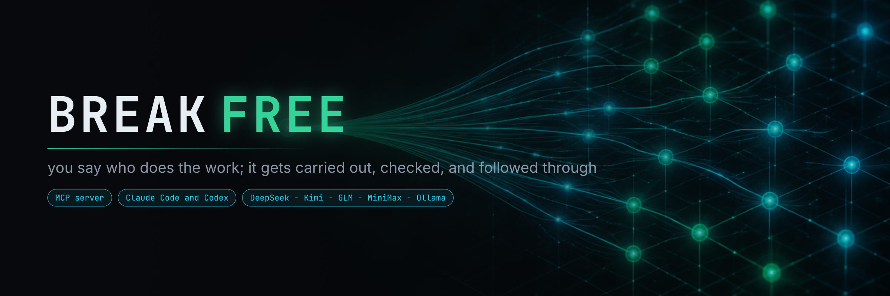
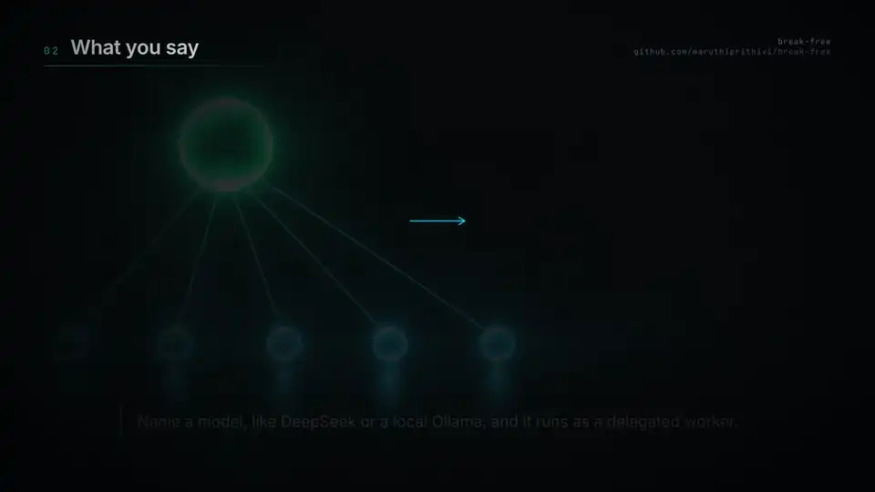
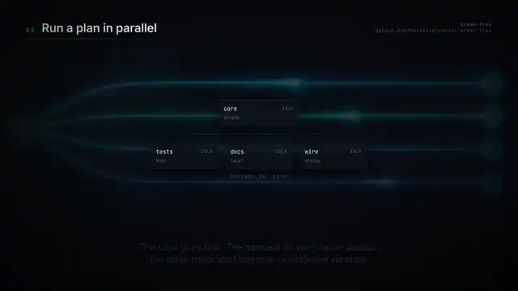

<p align="center">
  
</p>

<h1 align="center">Break Free</h1>
<p align="center"><b>The frontier model leads. Other models execute.</b></p>
<p align="center">
  <a href="#install">Install</a> ·
  <a href="#install-it-with-your-coding-agent">Agent install</a> ·
  <a href="https://maruthiprithivi.github.io/break-free/">Watch</a> ·
  <a href="docs/usage.md">Usage</a> ·
  <a href="#documentation">Docs</a> ·
  <a href="CHANGELOG.md">Changelog</a>
</p>

Claude Code and Codex earn their price on one part of a task: understanding what you actually want, breaking it down, deciding how the result will be proven, and judging what comes back. They charge exactly the same for the rest of it — the boilerplate, the unit tests, the migration, the docs, the bulk edit.

Break Free is a single MCP server that splits those two jobs. Your agent stays the **lead** and keeps the judgement. The **crew** — DeepSeek, Kimi/Moonshot, MiniMax, Z.AI/GLM, Ollama local and cloud, OpenRouter, OpenCode Zen, any vLLM or LM Studio endpoint — does the execution: in parallel, verified by a command **the gateway runs itself**, reviewed by a different vendor, and recorded in a Markdown ledger that outlives the session.

```bash
curl -fsSL https://raw.githubusercontent.com/maruthiprithivi/break-free/main/install.sh | bash
```

## Watch

<a href="https://maruthiprithivi.github.io/break-free/#intro"></a>

**[What Break Free actually does](https://maruthiprithivi.github.io/break-free/)** — you say who does the work; it gets carried out and checked. One minute, narrated, with subtitles.

<table>
<tr>
<td width="25%"><a href="https://maruthiprithivi.github.io/break-free/#delegate"></a><b>Hand a task to another model</b><br><sub>Name the model, name the check.</sub></td>
<td width="25%"><a href="https://maruthiprithivi.github.io/break-free/#handoff"></a><b>Send work to another harness</b><br><sub>Codex, omp or pi, on your subscription.</sub></td>
<td width="25%"><a href="https://maruthiprithivi.github.io/break-free/#parallel"></a><b>Split one job across several</b><br><sub>In parallel, with the checks you named.</sub></td>
</tr>
<tr>
<td width="25%"><a href="https://maruthiprithivi.github.io/break-free/#verdict"></a><b>Get an independent verdict</b><br><sub>From a vendor that did not write it.</sub></td>
<td width="25%"><a href="https://maruthiprithivi.github.io/break-free/#guard"></a><b>Nothing gets left behind</b><br><sub>The turn will not end on a failed run.</sub></td>
<td width="25%"><a href="https://maruthiprithivi.github.io/break-free/#resume"></a><b>Pick up where you left off</b><br><sub>The log lives in the repository.</sub></td>
</tr>
</table>

<sub>The clips above are silent previews: GitHub strips video players from README files. The narrated versions play on the <a href="https://maruthiprithivi.github.io/break-free/">project page</a>, source files are in <a href="docs/assets/">docs/assets/</a>, and the Remotion pipeline that builds them is in <a href="videos/">videos/</a>.</sub>

## Install

```bash
curl -fsSL https://raw.githubusercontent.com/maruthiprithivi/break-free/main/install.sh | bash
```

Clones into `~/.break-free`, checks Node, then walks you through **preflight → scope → build → providers and keys → install → postflight**, printing one line per check and ending in `GREEN`, `GREEN with warnings`, or `RED`. Re-run it any time to update. Flags pass through: `| bash -s -- --yes`.

Prefer to read it first, or already have a clone:

```bash
curl -fsSL https://raw.githubusercontent.com/maruthiprithivi/break-free/main/install.sh -o install.sh
less install.sh && bash install.sh
# or
git clone https://github.com/maruthiprithivi/break-free.git && cd break-free && ./install.sh
```

**You need** Node 20+, git, at least one of Claude Code or Codex ([many other harnesses](docs/usage.md#other-coding-agents-gemini-cli-copilot-cli-cursor-goose-amp-hermes-aider-cline-adal-openclaw-droid-kilo-code-roo-code-qoder-zed-opencode-kiro-cli-kimi-code-cli-antigravity-agy-pi-oh-my-pi-omp) work too), and one model — any provider key, or a local Ollama with no key at all. `gh` is optional, for the `github` worker capability.

**Check it worked:**

```bash
node ~/.break-free/setup.mjs --doctor     # no FAIL lines
claude mcp list                           # break-free-gateway ... Connected
```

Then ask your agent to `list providers`, or run `/break-free-resume`.

Every installer flag, what each prompt means, the scopes it writes, the manual path and a troubleshooting table: **[docs/install.md](docs/install.md)**.

## Install it with your coding agent

Paste this into Claude Code, Codex, Cursor, or any agent that can read a URL and run commands:

```
Install Break Free on this machine for me.
Read https://raw.githubusercontent.com/maruthiprithivi/break-free/main/AGENT-INSTALL.md
and follow it exactly, including the verification steps and the final report.
```

[`AGENT-INSTALL.md`](AGENT-INSTALL.md) is written for the agent rather than for you: prerequisites and what to do when one is missing, the four questions it must ask you, a non-interactive install that keeps your API keys in the environment and never writes them to disk, how to verify the result rather than trust the installer, a troubleshooting table, and an explicit list of things it must not do — no `sudo`, no keys in the transcript, no granting workers push or merge rights unless you ask.

## How it works

| Lead (Claude Code / Codex, frontier model) | Crew (DeepSeek, Kimi, GLM, MiniMax, Ollama, …) | Gateway (this server) |
|---|---|---|
| Talks to you; decomposes the goal into self-contained tasks with dependencies | Executes one task each, in parallel, with jailed tools | Schedules the graph with bounded concurrency; hands prerequisite reports to dependants |
| Writes acceptance criteria and **the `verify` command** for each task | Runs tests itself (`run` capability) before reporting | **Runs `verify` after the worker** — a real exit code, which cannot be faked; failure blocks dependants |
| Decides which vendor does what (`fast`/`strong`/`local`, a different vendor for review) | Records decisions and gotchas it hits (`ledger_note`) | Routes with fallback; injects CLAUDE.md/AGENTS.md, skills and ledger knowledge into every worker |
| Reads the consolidated report, diffs and verdicts; pushes back; commits; owns the result | | Tracks every task, outcome and verification in `.break-free/` so any later session resumes |

Two things do the real work. `verify` is a shell command **the gateway runs after the worker finishes**, so a pass is an exit code rather than a claim. The ledger is plain Markdown inside your repository, so the next session — or the next person — starts from what already happened.

Everything installs under the `break-free-*` prefix: the skills `break-free-model-gateway` and `break-free-github-flow`, the commands below, and the MCP server `break-free-gateway` (`break_free_gateway` on Codex). Full picture and repository layout: **[docs/architecture.md](docs/architecture.md)**.

## Using it

```
/break-free-resume                                   where were we?
/break-free-plan add rate limiting to the API with tests, docs and a migration
/break-free-delegate fast write unit tests for src/router.ts covering alias expansion
/break-free-review staged security
/break-free-panel should we move the session store to SQLite or keep JSON files?
/break-free-supervise implement rate limiting in src/server.ts --caps read,write,run --rounds 3
```

Or just say it: *"split this into parallel chunks and run them on deepseek, then have kimi review"*, *"hand the boilerplate to a cheap model"*, *"get a second opinion from three different vendors"*, *"have a local model do this, don't send the code anywhere"*, *"pick up where we left off"*. The skill tells the lead when to reach for the gateway, how to write instructions and verification, and how to judge what comes back.

The `run_plan` dependency graph, the ledger and how it survives merges, worktrees, guardrails, lending your MCP servers, model specs and fallback: **[docs/usage.md](docs/usage.md)**.

## Documentation

| | |
|---|---|
| [docs/install.md](docs/install.md) | every installer flag, each prompt explained, scopes, the manual path, troubleshooting |
| [AGENT-INSTALL.md](AGENT-INSTALL.md) | the same install, written for a coding agent to carry out |
| [docs/usage.md](docs/usage.md) | `run_plan`, the ledger, worktrees, guardrails, model specs, fallback, other harnesses |
| [docs/architecture.md](docs/architecture.md) | the operating model, the tool surface, repository layout |
| [docs/harness.md](docs/harness.md) | running Claude Code or Codex *on* DeepSeek, Kimi or Ollama; tmux harness sub-agents |
| [docs/operations.md](docs/operations.md) | the runtime log and diagnosing problems, operational notes, `break-free-github-flow` |
| [docs/testing.md](docs/testing.md) | the test suite, the mock provider, end-to-end checks |
| [videos/](videos/) | the Remotion source and Docker pipeline behind the banner and the videos |
| [docs/roadmap.md](docs/roadmap.md) · [docs/blueprint.html](docs/blueprint.html) | what is planned, and the architecture picture |

## Contributing, security, license

Contributions welcome — see [CONTRIBUTING.md](CONTRIBUTING.md) (run `npm test` in `model-gateway/` and `bash setup/selftest.sh` before opening a PR). Security issues: [SECURITY.md](SECURITY.md). Released under the [MIT License](LICENSE). Changes by version: [CHANGELOG.md](CHANGELOG.md).
