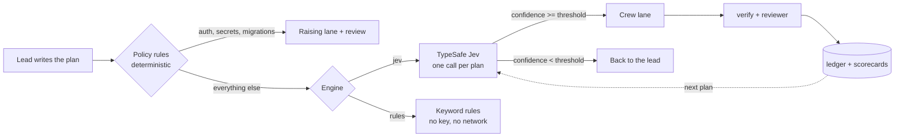

# Routing: who picks the model

`run_plan` and `delegate` take a `model` per task. When a task omits it, **routing** decides —
instead of the silent fallback to `defaults.model`.

Routing is **off by default**. It changes which model runs your work and what that costs, so that
has to be your choice, not an upgrade side effect.



## Turning it on

Three levels, highest wins, and a task with an explicit `model` is never routed at all:

| Level | How | Scope |
| --- | --- | --- |
| Task | `model: "..."` on the task | That task. Wins over everything. |
| Session | `routing: "jev" \| "rules" \| "off"` on the call | That `run_plan` / `delegate` call |
| Environment | `BREAK_FREE_ROUTING=jev\|rules\|off` | Every call in that shell or harness session |
| Global | `routing.engine` in `~/.config/model-gateway/config.json` | This machine |
| Project | `routing.engine` in `<repo>/.model-gateway.json` | This repo — but a project may not turn on `jev` (see below) |

**A project file cannot enable Jev.** A cloned repo must not be able to send its own source to a
third-party model; egress stays a user-level decision. `routing.engine: "jev"` in a project config
is ignored, and `rules`/`off` are honoured.

## The engines

### `off` — what Break Free did before

An omitted `model` means `defaults.model`. No decisions, no calls, no ledger fields. This is the
default, and it is also the escape hatch if routing ever misbehaves.

### `rules` — deterministic, no key, no network

One ordered regex table in `src/routing.ts`, split in two:

- **Judgement rules** first — what kind of *thinking* the task needs. `design|trade-offs|root
  cause|investigate` → `thinker`; `autonomous|overnight|sweep the whole repo` → `codex_handoff`;
  `as discussed|not sure|tbd` → `unclear`.
- Then **file evidence**: if every file the task touches is prose (`.md`, `.txt`, `.rst`, `.adoc`)
  it is a prose task, whatever it says. A changelog entry that mentions a migration is still a
  changelog entry.
- Then **implementation rules** — `migrat*|schema|refactor|concurrency` → `strong`; `rename|add a
  flag|unit test` → `fast`.
- Otherwise `fast`.

The rules engine never gates on a confidence threshold, because its "confidence" is invented. It
escalates only when a task matches the `unclear` pattern.

### `jev` — TypeSafe System One

Jev is not an LLM. It evaluates typed questions against a state and returns typed answers:
a Choice over lanes, a Score for difficulty, and two Nouls for sensitivity and repo context — four
questions per task, all answered **in parallel in a single request per plan**.

- **One call per plan.** A 12-task plan is one round trip. `routing.batch: "task"` sends one request
  per task instead; it costs more and is rarely better.
- **It hands work back.** Below `routing.threshold` (default `0.7`), or when it answers
  `lead_keeps`/`unclear`, the task is not run at all: `model` comes back `null`, the task is
  reported under "Escalated to you", and the ledger records it as the lead's, with the full
  probability distribution so you can see *why*.
- **No key, no problem.** Without `TYPESAFE_API_KEY` (or `providers.typesafe.apiKey`) the plan runs
  on `rules` and the result says `degraded: <reason>`. A router outage never fails a plan.
- **It degrades rather than throws.** `401`/`422` are not retried and fall back to rules; `429` and
  `529` are retried with exponential backoff honouring `retry-after`.
- **Pin it if you tune it.** `jev-latest` moves. If you set a threshold against a version, pin
  `providers.typesafe.defaultModel` to `jev-1.13.0`.

Get a key at <https://console.typesafe.ai/settings/keys>, then
`export TYPESAFE_API_KEY=...` or `configure_provider typesafe apiKey=...`.

Jev's documented limits shape the design: it cannot count (file counts are bucketed in code), its
accuracy falls with padded state (the state is capped at `routing.maxStateTokens` and trimmed in a
fixed order), it reads instructions literally, and it will not tell you why it decided. That last
one is why the ledger stores the probabilities instead of a rationale.

## The lanes

| Lane | What it means | Default alias |
| --- | --- | --- |
| `local` | Prose, docs, comments — or work that must not leave this machine | `local` |
| `fast` | Small, fully specified, mechanical: rename, test, flag, one-line fix | `fast` |
| `strong` | Core logic, multi-file, migrations, contract changes | `strong` |
| `thinker` | Ambiguous, design or diagnosis, no obvious right answer | `thinker` |
| `codex_handoff` | Long autonomous refactor better run in a second harness | `strong` |
| `lead_keeps` | Needs your judgement or authority | *back to you* |
| `unclear` | Not enough information in the task to decide | *back to you* |

`routing.laneMap` re-points any lane, including to a crew alias, and `null` sends that lane back to
you. The lane definitions themselves (`what` / `not_for` / `examples`) live in `LANE_SPEC` in
`src/routing.ts` and are sent to Jev verbatim — that is the one file to edit when a lane is
misclassified.

## Sensitivity: two different problems

`routing.sensitiveLane` says which problem you are solving, because they are not the same:

- **`"strong"` (default) — care.** The lane is raised to *at least* `strong` and **never lowered**:
  a `thinker` answer stays `thinker`, a `local` answer stays `local` (it is already the safest place
  for the data), and a `fast` answer is overruled upward. The task is also marked
  `requires_review`, and `run_plan` runs an independent (different-vendor) review on it even when the
  plan did not ask for reviews. Raising the model without a second pair of eyes is not a guardrail.
- **`"local"` — data residency.** Everything sensitive runs on this machine, always, whatever any
  model says.

Both are decided **before** any model is asked, from file globs: the built-in list (auth, secrets,
credentials, `.env`, passwords, payments, billing, migrations, `*.pem`/`*.key`, `infra/prod/**`),
plus `routing.sensitivePaths`, plus **your own `policy.rules` globs** — a path you already declared
special for the tool jail is special here too. Jev's own `sensitive` answer (a Noul) applies the
same rule when no glob matched.

## What lands in the ledger

Per task frontmatter:

```yaml
routed_by: jev                 # jev | rules | policy
route_lane: strong
route_confidence: 0.88
route_probs: strong=0.88 fast=0.09 local=0.03
route_ms: 412
overridden_by: deepseek/deepseek-v4-pro   # only when you replace a routed lane by hand
```

One journal line per decision, which is the thing to screenshot:

```
route migration → strong · lane strong confidence 0.88 · sensitive (policy: db/migrations/0031_rate_limit.sql, p=0.93) · by policy in 412ms
route flaky-test → lead · lane lead_keeps confidence 0.41 · by confidence (escalated: confidence) in 412ms
```

`overridden_by` appears when you re-run a recorded task with an explicit model. Address the task by
its **ledger id** to pick it up (`{"id": "T-007", "model": "kimi/kimi-k3"}`); the original route is
kept next to the override rather than being erased.

## The feedback loop

Every executed routed task appends one line to `.break-free/scorecards.jsonl`:

```json
{"task":"T-004","plan":"add rate limiting","lane":"strong","model":"deepseek/deepseek-v4-pro","tags":["migration"],"verify_ok":false,"attempts":1,"ms":18422,"cost_usd":0.0031,"at":"..."}
```

`verify_ok` is the gateway's own verify result — `null` when the task had no verify command, so it
is excluded from pass rates rather than counted as a pass. The next plan's Jev state quotes them as
`migration: fast 0/2 verify pass, strong 1/1`, which is how a lane that keeps failing stops being
chosen. Set `tags` on your plan tasks; they are the join key.

## `route` — ask without running anything

```
route({ tasks: [{ id, task, files?, tags?, acceptance?, verify? }], goal?, engine?, threshold? })
```

Returns per task `{ lane, model, confidence, probabilities, difficulty, sensitive,
needs_repo_context, reason, policy_hits, requires_review, escalated, proposed_lane, ms }`, plus the
engine that actually answered, latency, cost, state size and whether it was trimmed. Use it to
preview a plan, or to check one task, without spending a worker.

## Measuring it: `bf`

```bash
bf route --plan bench/demo-plan.json --engine jev     # the route table
bf bench route                                        # four routers, one table
bf bench route --live --record bench/jev-recording.json   # real API, save the decisions
bf demo                                               # 12-task plan, three ways
```

`bf bench route` scores four routers over 60 labeled subtasks (`bench/route-set.jsonl`), each
carrying the lane the lead would pick and the cheapest lane that actually passed `verify`:

| Router | What it is |
| --- | --- |
| `lead` | The label itself — 100% by construction, and the cost baseline to beat |
| `rules` | The deterministic engine, offline |
| `jev` | TypeSafe System One: a recording offline, api.typesafe.ai with `--live` |
| `llm` | A frontier model prompted as a router. Reported **unmeasured** without a provider key, never guessed |

`under %` is measured only over tasks the router was free to choose for; guardrail-forced tasks are
reported separately as `forced %`. Mixing them would call a deliberately-kept-local task "too cheap".
Cost figures use a declared 20k-in/4k-out token budget per task at your configured list prices —
an estimate of the same calls on `strong`, not a re-run.

## Honesty notes

- **Offline `jev` numbers are a replay, not a measurement.** `bench/jev-recording.json` exists so the
  bench and the demo run with no key; `bench/make-recording.mjs` generates it from the labels with a
  fixed, legible rule. Any number you publish must come from `--live`.
- **`cost_report` savings are a replay estimate** of the same token usage priced on `strong`. Real
  savings differ with cache, context reuse and retries.
- **Routing spend is tracked separately** from crew spend: routing calls log as `route.decision`
  and appear under `routing_savings.routing`, so they never inflate crew cost.
- **The vendor's accuracy claims are vendor-only.** The bench is the story. If `rules` matches Jev on
  your tasks, that is the finding.
