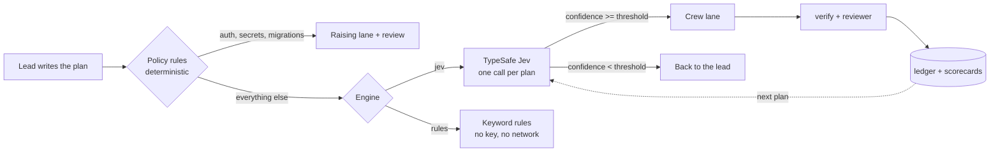

# Routing: who picks the model

`run_plan` and `delegate` take a `model` per task. When a task omits it, **routing** decides —
instead of the silent fallback to `defaults.model`.

Routing is **off by default**. It changes which model runs your work and what that costs, so that
has to be your choice, not an upgrade side effect.



## Turning it on

Three levels, highest wins, and a task with an explicit `model` is never routed at all:

| Level | How | Scope |
| --- | --- | --- |
| Task | `model: "..."` on the task | That task. Wins over everything. |
| Session | `routing: "jev" \| "rules" \| "off"` on the call | That `run_plan` / `delegate` call |
| Environment | `BREAK_FREE_ROUTING=jev\|rules\|off` | Every call in that shell or harness session |
| Project | `routing.engine` in `<repo>/.model-gateway.json` | This repo |
| Global | `routing.engine` in `~/.config/model-gateway/config.json` | This machine |

All three places you would expect to stand — session, project, global — can turn Jev on **or** off,
and the narrower one wins. A project file overrides the global setting, and a session parameter
overrides both.

**A project can enable Jev, and you can veto that.** A repo's `.model-gateway.json` is committed
and read from the workspace, so point it at `jev` and everyone who clones that repo routes through
TypeSafe. That is the same egress the file already has through `defaults.model`, so it is allowed by
default — but if you want every routing decision to stay on your machine, set this in **your user
config**, where no repo can reach it:

```json
{ "routing": { "projectMayEnableJev": false } }
```

Projects may then still ask for `rules` or `off`, just not `jev`. The flag is only ever read from
the user config, so a repo cannot lift its own restriction.

## The engines

### `off` — what Break Free did before

An omitted `model` means `defaults.model`. No decisions, no calls, no ledger fields. This is the
default, and it is also the escape hatch if routing ever misbehaves.

### `rules` — deterministic, no key, no network

One ordered regex table in `src/routing.ts`, split in two:

- **Judgement rules** first — what kind of *thinking* the task needs. `design|trade-offs|root
  cause|investigate` → `thinker`; `autonomous|overnight|sweep the whole repo` → `codex_handoff`;
  `as discussed|not sure|tbd` → `unclear`.
- Then **file evidence**: if every file the task touches is prose (`.md`, `.txt`, `.rst`, `.adoc`)
  it is a prose task, whatever it says. A changelog entry that mentions a migration is still a
  changelog entry.
- Then **implementation rules** — `migrat*|schema|refactor|concurrency` → `strong`; `rename|add a
  flag|unit test` → `fast`.
- Otherwise `fast`.

The rules engine never gates on a confidence threshold, because its "confidence" is invented. It
escalates only when a task matches the `unclear` pattern.

### `jev` — TypeSafe System One

Jev is not an LLM. It evaluates typed questions against a state and returns typed answers:
a Choice over lanes, a Score for difficulty, and two Nouls for sensitivity and repo context — four
questions per task, all answered **in parallel in a single request per plan**.

- **One call per plan.** A 12-task plan is one round trip. `routing.batch: "task"` sends one request
  per task instead; it costs more and is rarely better.
- **It hands work back.** Below `routing.threshold` (default `0.7`), or when it answers
  `lead_keeps`/`unclear`, the task is not run at all: `model` comes back `null`, the task is
  reported under "Escalated to you", and the ledger records it as the lead's, with the full
  probability distribution so you can see *why*.
- **No key, no problem.** Without `TYPESAFE_API_KEY` (or `providers.typesafe.apiKey`) the plan runs
  on `rules` and the result says `degraded: <reason>`. A router outage never fails a plan.
- **It degrades rather than throws.** `401`/`422` are not retried and fall back to rules; `429` and
  `529` are retried with exponential backoff honouring `retry-after`.
- **Pin it if you tune it.** `jev-latest` moves. If you set a threshold against a version, pin
  `providers.typesafe.defaultModel` to `jev-1.13.0`.

Get a key at <https://console.typesafe.ai/settings/keys>, then
`export TYPESAFE_API_KEY=...` or `configure_provider typesafe apiKey=...`.

Jev's documented limits shape the design: it cannot count (file counts are bucketed in code), its
accuracy falls with padded state (the state is capped at `routing.maxStateTokens` and trimmed in a
fixed order), it reads instructions literally, and it will not tell you why it decided. That last
one is why the ledger stores the probabilities instead of a rationale.

## The lanes

| Lane | What it means | Default alias |
| --- | --- | --- |
| `local` | Prose, docs, comments — or work that must not leave this machine | `local` |
| `fast` | Small, fully specified, mechanical: rename, test, flag, one-line fix | `fast` |
| `strong` | Core logic, multi-file, migrations, contract changes | `strong` |
| `thinker` | Ambiguous, design or diagnosis, no obvious right answer | `thinker` |
| `codex_handoff` | Long autonomous refactor better run in a second harness | `strong` |
| `lead_keeps` | Needs your judgement or authority | *back to you* |
| `unclear` | Not enough information in the task to decide | *back to you* |

`routing.laneMap` re-points any lane, including to a crew alias, and `null` sends that lane back to
you. The lane definitions themselves (`what` / `not_for` / `examples`) live in `LANE_SPEC` in
`src/routing.ts` and are sent to Jev verbatim — that is the one file to edit when a lane is
misclassified.

## Sensitivity: two different problems

`routing.sensitiveLane` says which problem you are solving, because they are not the same:

- **`"strong"` (default) — care.** The lane is raised to *at least* `strong` and **never lowered**:
  a `thinker` answer stays `thinker`, a `local` answer stays `local` (it is already the safest place
  for the data), and a `fast` answer is overruled upward. The task is also marked
  `requires_review`, and `run_plan` runs an independent (different-vendor) review on it even when the
  plan did not ask for reviews. Raising the model without a second pair of eyes is not a guardrail.
- **`"local"` — data residency.** Everything sensitive runs on this machine, always, whatever any
  model says.

Both are decided **before** any model is asked, from file globs: the built-in list (auth, secrets,
credentials, `.env`, passwords, payments, billing, migrations, `*.pem`/`*.key`, `infra/prod/**`),
plus `routing.sensitivePaths`, plus **your own `policy.rules` globs** — a path you already declared
special for the tool jail is special here too. Jev's own `sensitive` answer (a Noul) applies the
same rule when no glob matched.

## What lands in the ledger

Per task frontmatter:

```yaml
routed_by: jev                 # jev | rules | policy
route_lane: strong
route_confidence: 0.88
route_probs: strong=0.88 fast=0.09 local=0.03
route_ms: 412
overridden_by: deepseek/deepseek-v4-pro   # only when you replace a routed lane by hand
```

One journal line per decision, which is the thing to screenshot:

```
route migration → strong · lane strong confidence 0.88 · sensitive (policy: db/migrations/0031_rate_limit.sql, p=0.93) · by policy in 412ms
route flaky-test → lead · lane lead_keeps confidence 0.41 · by confidence (escalated: confidence) in 412ms
```

`overridden_by` appears when you re-run a recorded task with an explicit model. Address the task by
its **ledger id** to pick it up (`{"id": "T-007", "model": "kimi/kimi-k3"}`); the original route is
kept next to the override rather than being erased.

## The feedback loop

Every executed routed task appends one line to `.break-free/scorecards.jsonl`:

```json
{"task":"T-004","plan":"add rate limiting","lane":"strong","model":"deepseek/deepseek-v4-pro","tags":["migration"],"verify_ok":false,"attempts":1,"ms":18422,"cost_usd":0.0031,"at":"..."}
```

`verify_ok` is the gateway's own verify result — `null` when the task had no verify command, so it
is excluded from pass rates rather than counted as a pass. The next plan's Jev state quotes them as
`migration: fast 0/2 verify pass, strong 1/1`, which is how a lane that keeps failing stops being
chosen. Set `tags` on your plan tasks; they are the join key.

## `route` — ask without running anything

```
route({ tasks: [{ id, task, files?, tags?, acceptance?, verify? }], goal?, engine?, threshold? })
```

Returns per task `{ lane, model, confidence, probabilities, difficulty, sensitive,
needs_repo_context, reason, policy_hits, requires_review, escalated, proposed_lane, ms }`, plus the
engine that actually answered, latency, cost, state size and whether it was trimmed. Use it to
preview a plan, or to check one task, without spending a worker.

## Measuring it: `bf`

```bash
bf route --plan bench/demo-plan.json --engine jev     # the route table
bf bench route                                        # four routers, one table
bf bench route --live --record bench/jev-recording.json   # real API, save the decisions
bf demo                                               # 12-task plan, three ways
```

`bf bench route` scores four routers over 60 labeled subtasks (`bench/route-set.jsonl`), each
carrying the lane the lead would pick and the cheapest lane that actually passed `verify`:

| Router | What it is |
| --- | --- |
| `lead` | The label itself — 100% by construction, and the cost baseline to beat |
| `rules` | The deterministic engine, offline |
| `jev` | TypeSafe System One: a recording offline, api.typesafe.ai with `--live` |
| `llm` | A frontier model prompted as a router. Reported **unmeasured** without a provider key, never guessed |

`under %` is measured only over tasks the router was free to choose for; guardrail-forced tasks are
reported separately as `forced %`. Mixing them would call a deliberately-kept-local task "too cheap".
Cost figures use a declared 20k-in/4k-out token budget per task at your configured list prices —
an estimate of the same calls on `strong`, not a re-run.

### Measured, 2026-09-19 (`jev-1.13.0`, live)

```
router  exact %  crew %  ±1 tier %  under %  forced %  escal %  ms/plan  $/1000   $ plan   vs strong
lead    100      100     100        0        0         13.33    0        $0       $0.537   54.7%
rules   53.33    63.27   95.83      31.03    0         1.67     1.2      $0       $0.4258  64.1%
jev     71.67    83.67   100        6.98     18.33     10       311.4    $0.0544  $0.6003  49.4%
llm     unmeasured
```

`crew %` is agreement over the 49 tasks whose expert label is a real crew lane. The other 11 are
`codex_handoff`, `lead_keeps` and `unclear` — meta-labels about harness logistics and product
authority that nothing in a task description implies, so no router can be expected to hit them.

Against the brief's targets, with the misses stated:

| # | Criterion | Target | Measured | |
| --- | --- | --- | --- | --- |
| 1 | Crew cost vs all-`strong` | ≥ 50% lower | 49.4% | **miss by 0.6pt** — `sensitiveLane: "strong"` deliberately upgrades 11 of 60 |
| 4 | Under-routing | ≤ 10% | 6.98% | pass |
| 5 | Agreement, exact lane | ≥ 80% | 71.67% | **miss** — 11 meta-labels + 3 real under-routes |
| 5 | Agreement, ±1 tier | ≥ 95% | 100% | pass |
| 5 | (breakdown) crew lanes only | — | 83.67% | clears 80 |
| 6 | 12-task plan | ≤ 2 s | 1.22 s | pass |
| 7 | Routing cost | ≤ $0.001/plan | $0.000663 | pass |
| 9 | Escalation band | 10–25% | 10% | pass, bottom edge |
| 10 | Policy safety | never cheaper than policy | 18.33% forced, 0 violations | pass |
| 11 | Beats the LLM router | ≥ 20× faster, ≥ 50× cheaper | — | unmeasured, no frontier key |

Not measured here: criteria 2, 3 and 8 (first-pass and after-retry pass rates, calibration) — they
need real crew runs with `verify` outcomes, which is what the scorecards collect.

Jev is not "just rules": 71.67% vs 53.33% exact, 83.67% vs 63.27% on crew lanes, and 6.98% vs
31.03% under-routing. The rules engine also *looks* cheaper (64.1% vs 49.4%) precisely because it
under-routes three times as often — that is the trade the guardrail exists to catch.

### Ten real workflows, routed four ways

The bench scores flat subtasks. `bf scenarios` scores **work**: ten plans a user would actually hand
to an agent — ship a feature, fix a flaky test, upgrade a dependency, add auth, chase a performance
regression, add CI, split a god-module, add logging, harden the payment path, write a migration
guide — 80 tasks in total. Each scenario is routed as its own plan, the way `run_plan` does it,
through four arms: `jev`, `rules`, `off` (no routing at all — every task on `defaults.model`), and
`lead` (the expert label, the bar to beat).

Measured live, 2026-09-19 (`jev-1.13.0`):

```
right lane     jev 70%   rules 45%   off 25%   lead 100%
under-routed   jev  4%   rules 33%   off 45%   lead   0%
escalated      jev 17/80
crew cost      jev $0.7823  (50.5% below all-strong, 20.8% below the lead's own picks)
routing time   jev 6530 ms for 10 plans (653 ms/plan)   rules ~0 ms
decision cost  $0.004036 for 10 routing calls covering 80 tasks
```

The second line is the one that matters. **Doing nothing is the most dangerous policy**: with no
routing, 45% of tasks go to a lane weaker than the one that actually passes. Static rules get that
to 33%; Jev gets it to 4%. And Jev's crew bill is **20.8% below the expert lead's own picks**,
because the labels are conservative and Jev reliably finds the cheaper lane that still passes.

Per-scenario detail, one line each, and the full tables: `bf scenarios`. It is offline by default
and reproducible — the recording carries the live latency, so a replay does not report its own
near-zero local time as the routing time, and crew cost is priced from the **shipped** alias and
price table rather than your local overrides, or the same run would print different money on
different machines.

### What we tried and rejected

Splitting `codex_handoff`, `lead_keeps` and `unclear` out of the lane Choice and into their own Noul
questions looked obviously right: three of the seven options are not lanes, and they were diluting
the distribution over the four that are. It was implemented, measured live, and **reverted**:

| | 7-option Choice (shipped) | 5 options + Nouls |
| --- | --- | --- |
| exact lane agreement | 43/60 | 42/60 |
| crew-lane agreement | 41/49 | 37/49 |
| mean lane confidence | 0.887 | **0.921** |
| questions per task | 4 | 6 |

The dilution was real — confidence rose exactly as predicted — but it did not buy better lanes, and
three of the four lost agreements were cosmetic (`codex_handoff` maps to `strong`, so the same model
ran either way). A separate "does the user need to decide this?" question also could not separate a
product decision from a technical design decision: the two groups overlapped across 0.75–0.90, so it
fired on design questions that the `thinker` lane exists to serve. Two more questions per task for
no measured gain is not a trade worth making, so the seven-option Choice stays.

## Honesty notes

- **The recording is real, and offline runs replay it.** `bench/jev-recording.json` and
  `bench/demo-recording.json` are captures from `api.typesafe.ai`, replayed through the real
  TypeSafe client so the bench and the demo run with no key. The metrics above reproduce offline;
  only the **latency** column is measured live. Regenerate with `bf bench route --live --record …`
  (needs `TYPESAFE_API_KEY`).
- **`cost_report` savings are a replay estimate** of the same token usage priced on `strong`. Real
  savings differ with cache, context reuse and retries.
- **Routing spend is tracked separately** from crew spend: routing calls log as `route.decision`
  and appear under `routing_savings.routing`, so they never inflate crew cost.
- **The vendor's accuracy claims are vendor-only.** The bench is the story. Here it says Jev is
  clearly better than static rules and misses the brief's exact-agreement target — both are in the
  table above rather than the second one being quietly dropped.

### Two bugs the live API found that the mock could never have

Both were caught the first time real decisions were compared with the replay, and both would have
shipped silently otherwise:

1. **Jev never saw which task each question was about.** The docs say the question key *is not sent
   to the model*, so `core-limiter__sensitive` told it nothing — and a question asking about "this
   subtask" while the state held twelve of them was answered about the plan as a whole. Every task
   in a plan containing a migration came back `sensitive`, `difficulty 4`, confidence ~0.5. Fixed by
   opening every instruction with the state path it is about (`state.tasks[3]`, id and title). The
   mock could not catch this: it answers by key, which is precisely what the model does not see.
2. **A big plan did not fit one request.** 60 tasks × 4 questions is ~30k tokens of questions alone
   (each lane question carries all seven option rubrics), and TypeSafe answers
   `400 max_tokens_exceeded`. `routing.maxRequestTokens` (default 24k) now splits a plan into
   several requests that each fit — which also gives each chunk a smaller, untrimmed state — and
   `route`/`bf` report the request count.
